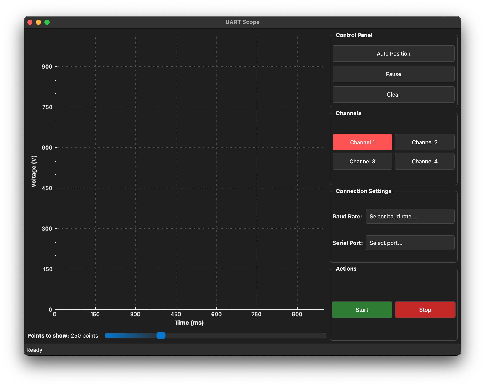
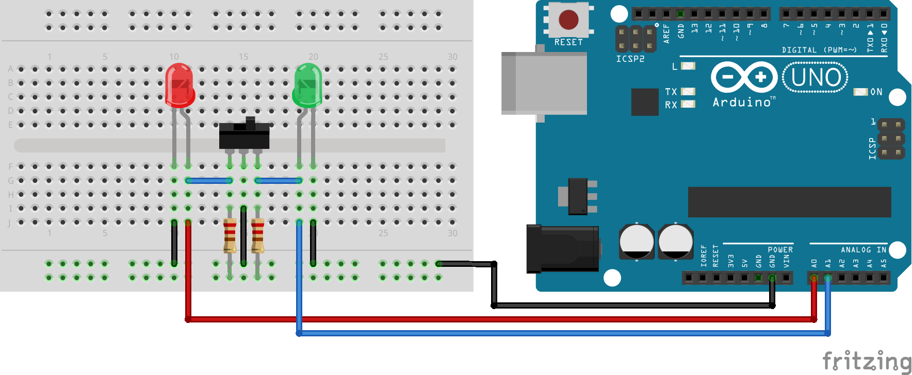
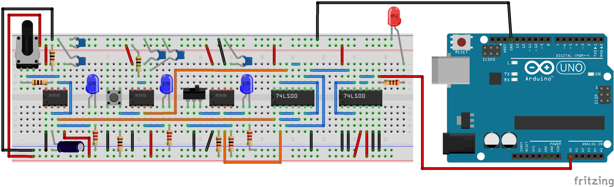

# uart-scope


## Project Purpose

Our story begins with the creation of a DIY analog clock module on a breadboard. Everything seemed to be going smoothly until the time came to test the circuit. To evaluate the quality of the generated clock signal, I needed to analyze the output waveforms, but there was a problem: I didn't have an oscilloscope available.

Then an idea was born: to build one.

Soon, I realized that building a fully electronic oscilloscope, without any computer support, would be a complex task. At that point, I came up with a more accessible alternative: creating a DIY oscilloscope using a microcontroller, such as an Arduino UNO R3. The idea was simple but effective: use the ADC (Analog to Digital Converter) and the analog pins (A0, ..., A3) as oscilloscope channels, with the corresponding probes, and transmit the data to the computer via the UART (Universal Asynchronous Receiver-Transmitter) protocol.

At this point, I needed a software to read the data and display it in real time. So, with the excuse of this project, I took the opportunity to learn Qt. The data read by the microcontroller will be acquired by a Qt application, which will process them and present them through an elegant and minimal graphical interface, offering the user a clear representation of the waveforms.

> [!WARNING]
> The first version of the software was written in Python, but I decided to rewrite it in C++ using the Qt framework to improve performance and learn something new. For this reason, inside the `software/` directory, you will find two versions of the software: `legacy-python-version/` and `cpp-version/`. I recommend using the C++ version because it is more efficient and has a better graphical interface.

> [!WARNING]
> The Qt application is already tested on Linux and macOS (Monterey).

## Download and Installation

> [!WARNING]
> You need to have the [PlatformIO](https://platformio.org/install/ide?install=vscode) extension installed on your Visual Studio Code.

Use the following command to clone the repository:

```
git clone https://github.com/AntonioBerna/uart-scope.git
```

Using the `ls` command inside the `uart-scope/` directory, you can see two directories: `firmware/` and `software/`. The first contains the code for the microcontroller, while the second contains the code for the Qt application.

Certainly, you will need to upload the firmware to the microcontroller before running the software. To do this, open the `firmware/` directory in Visual Studio Code and upload the code to the microcontroller using the PlatformIO extension.

After uploading the firmware, open the `software/cpp-version/` directory in Visual Studio Code and build the Qt application using the following commands:

```bash
# Linux & macOS
./make.sh init
./make.sh build
```

> [!NOTE]
> The `software/cpp-version/make.sh` script is a simple script that automates the build process of the Qt application. It is not necessary to use it, but it can be useful to simplify the build process. If you prefer, you can build the application manually using the `qmake` and `make` commands.

## Uninstall

To uninstall the project, simply delete the `uart-scope/` directory because the project does not create any files outside of it.

## Usage

### Firmware

To run the firmware you need to upload the code to the microcontroller using the PlatformIO extension. After uploading the code, you can open the serial monitor to see the data being transmitted by the microcontroller.

> [!NOTE]
> To change the baud rate of the serial communication, you can modify the `BAUD_RATE` constant in the `firmware/src/main.cpp` file.
> ```cpp
> #define BAUD_RATE 115200
> ```

### Software

To run the Qt application you need the following command:

```bash
# Linux
./bin/uart-scope

# macOS
./bin/uart-scope.app/Contents/MacOS/uart-scope
```

obtain the following result:

<p align="center">
    
</p>

The Qt application has a simple and intuitive interface. The main window is divided into two parts: the right part contains the controls for the oscilloscope, while the left part contains the graphical representation of the waveforms.

At the first start, you can select baud rate (to match the baud rate set in the firmware) and serial port from the drop-down menus. Then, you can press the `Start` button to establish the connection with the microcontroller. If the connection is successful, after a few seconds, you will see the waveforms displayed in the graph.

> [!CAUTION]
> Set baud rate first and then select the serial port.

Also you can use:

- `Auto Position` button to automatically adjust the position of the waveforms in the graph;
- `Pause` button to stop the acquisition of data;
- `Clear` button to clear the graph.

Finally you can select 4 different channels to display the waveforms and you can use the `Stop` button to close the connection with the microcontroller.

## Possible Errors

### `lsof` Error

If you encounter the following error:

```
RuntimeException: Error opening serial port /dev/ttyACM0: Port busy
```

you can solve it by running the following command:

```
sudo lsof /dev/ttyACM0
```

> [!NOTE]
> Replace `/dev/ttyACM0` with the serial port that is busy.

This command will show you the process that is using the serial port. You can then kill the process using the following command:

```
sudo kill -9 <PID>
```

where `<PID>` is the process ID of the process that is using the serial port.

## Testing

For all the tests, I used an Arduino UNO R3 as the microcontroller.

> [!NOTE]
> All the diagrams were created using the [Fritzing](https://fritzing.org/) software. You can find the `.fzz` files in the `.github/fritzing/` directory.

### Beginner: Toggle Switch

In this test, I created a simple circuit with a switch and two red and green LEDs. The microcontroller uses two probes (via analog pins A0 and A1) to read the state of the LEDs and transmits the data to the computer via the UART protocol. The Qt application receives the data and displays the waveforms in real time.

Below is the assembly diagram for this test:

<p align="center">
    
</p>

and the [result shown by the Qt application](.github/videos/toggle-switch.mp4).

In the video you can clearly see that one wave is higher (i.e. has a higher voltage value) than the other. This is normal because by construction the red and green LED diodes have a different potential difference across their ends. Ergo the green LED has a greater potential difference.

Switching delays due to the type of switch used are also visible.

### Intermediate: Clock Module

In this test, I created a simple circuit with a 555 timer to generate a square wave signal. The microcontroller uses one probe (via analog pins A0) to read the signal and transmits the data to the computer via the UART protocol. The Qt application receives the data and displays the waveforms in real time.

Below is the assembly diagram for this test:

<p align="center">
    
</p>

and the [result shown by the Qt application](.github/videos/clock-module.mp4).

In the video you can see the square wave signal generated by the 555 timer. In the video you can clearly see how the frequency increases. This is thanks to the use of the potentiometer present in the circuit. The information capture was reliable.

Finally the other channels of the oscilloscope have noise because they are not connected to anything.

### Advanced: Signal Generator

TODO...
